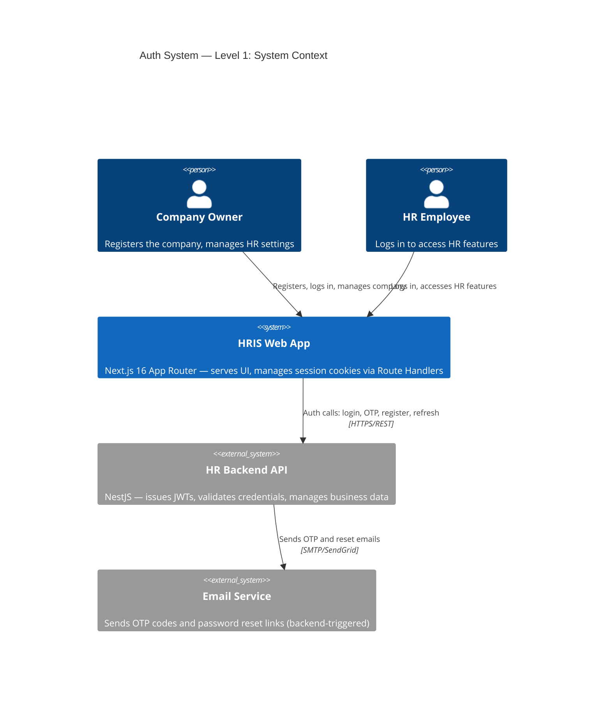
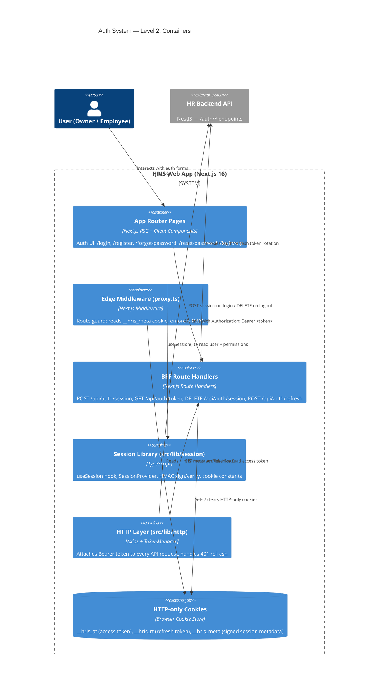
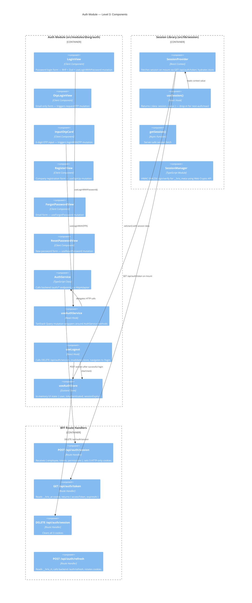

# Auth — System Design Overview (v2 — Custom Session)

> ADR-002 removed NextAuth. All session management is now owned by this codebase.
> See `decisions/ADR-002-remove-nextauth.md` for the full rationale.

---

## C4 — Level 1: System Context



---

## C4 — Level 2: Container



---

## C4 — Level 3: Component (Auth Module)



---

## Key Design Decisions

### 1. Route Handlers as BFF (Backend For Frontend)

Auth tokens never touch client-side JavaScript after login. The sequence is:

```
LoginView
  → useLoginWithPassword()
    → AuthService.loginWithPassword() → POST /auth/login/password (backend)
    ← { employee, tokens, permissions }
  → POST /api/auth/session (Route Handler)
    → sets __hris_at, __hris_rt, __hris_meta as HTTP-only cookies
  → router.push('/login/continue')
```

### 2. Session Metadata Cookie for Middleware

`proxy.ts` runs at the Edge on every request. It cannot make async backend calls.
`__hris_meta` is a compact signed cookie `{ id, role, permissions, exp }` that the
middleware can verify synchronously using the Web Crypto API.

```
proxy.ts
  → request.cookies.get('__hris_meta')
  → SessionManager.verify(cookie, AUTH_SECRET)
  → extract { role, permissions }
  → enforce ACCESS_LEVELS rules
```

### 3. TokenManager reads via Route Handler

Axios interceptor needs the access token for every API call. The token is in an
HTTP-only cookie — JavaScript cannot read it. The TokenManager calls
`GET /api/auth/token`, which reads the cookie server-side and returns the token.
The result is cached in memory with a 5-minute expiry buffer.

### 4. Drop-in `useSession()` Compatibility

All 17 existing `useSession()` consumers require only an import path change:

```ts
// Before
import { useSession } from 'next-auth/react';
// After
import { useSession } from '@/lib/session';
```

The returned `{ data, status }` shape is identical.

### 5. Zustand Store is Secondary

`useAuthStore` holds `{ user, isAuthenticated }` for synchronous in-component reads
(e.g. rendering a user avatar without an async call). The `SessionProvider` populates
it from the session on mount. **The cookie is the source of truth** — the store is
a cache.

### 6. Unified Session Path for OTP + Password

Both login flows call `POST /api/auth/session` after success. The session
establishment is identical regardless of how the user authenticated.

---

## Component Tree

```
RootLayout
└── SessionProvider          ← populates useAuthStore on mount
    └── StoreProvider
        └── (private) layout
            └── (org) layout  ← useSession() for user display
                └── [feature pages]
```

Auth pages (`/login`, `/register`, etc.) sit outside the session-requiring layout.
`proxy.ts` handles all redirects.
