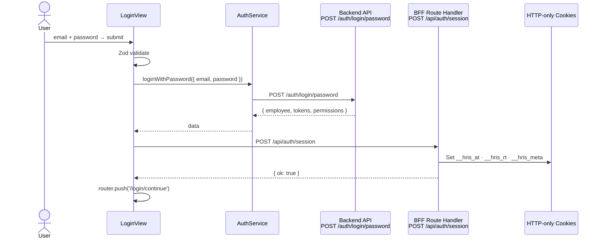
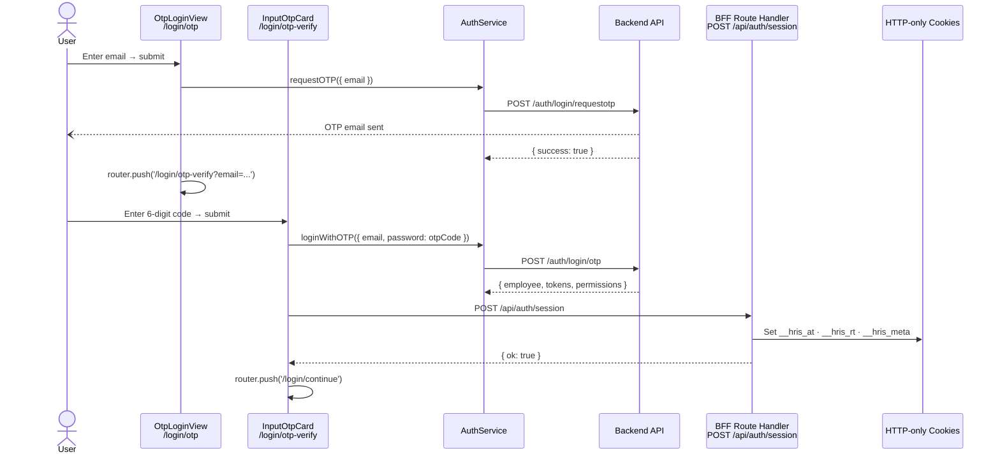
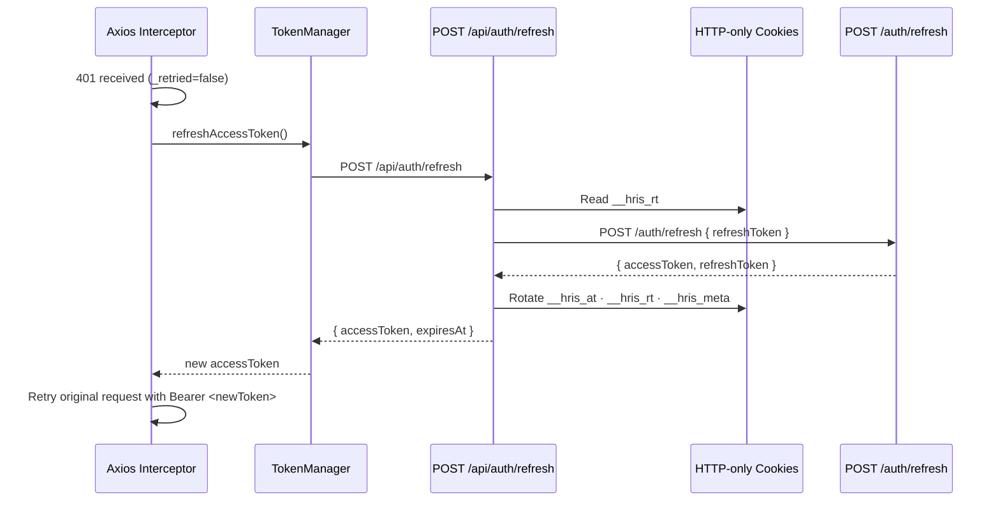
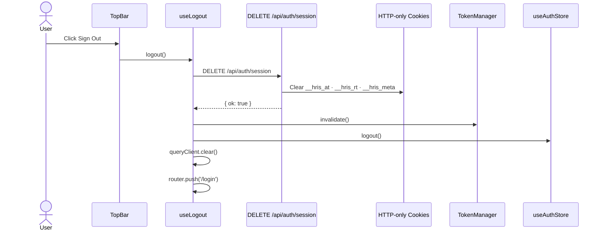

# Auth — Login Flow (Sequence Diagrams) — v2 Custom Session

> NextAuth removed (ADR-002). Session established via BFF Route Handlers.

---

## Password Login — Happy Path

---

## OTP Login — Happy Path

---

## Token Refresh on 401

---

## Logout

